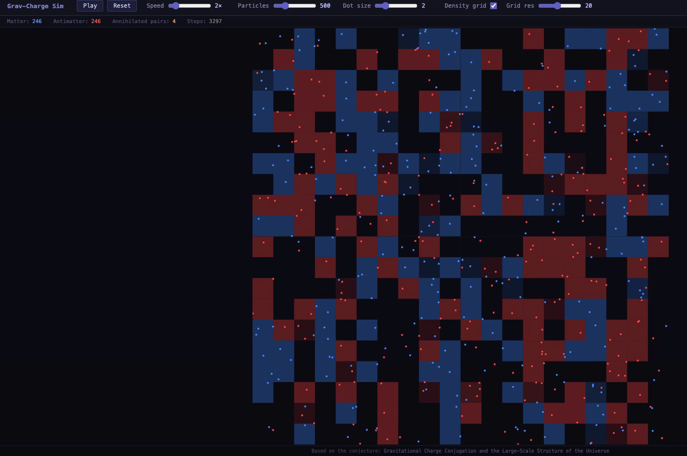

# Grav-Charge Sim

A real-time N-body simulation testing a conjecture about gravitational charge asymmetry — the hypothesis that matter and antimatter carry opposite gravitational charge, analogous to opposite electric charge in electromagnetism.

**[Conjecture Paper](https://zenodo.org/records/19839829)** &nbsp;|&nbsp; **[Layman Version](https://zenodo.org/records/19839829)**

---

## What You're Looking At



- 🔵 **Blue** — matter-dominated regions
- 🔴 **Red** — antimatter-dominated regions
- ⬛ **Black** — neutral boundary zones where gravitational charges cancel

The separation emerges spontaneously. No external mechanism. No inflation field. Just one modified assumption applied to standard Newtonian gravity.

---

## The Modification

Standard Newtonian gravity:
```
F = G * m1 * m2 / r²  (always attractive)
```

Modified gravitational charge:
```
F = G * m1 * m2 * q1 * q2 / r²
```

Where `q = +1` for matter, `q = -1` for antimatter.

- Same charge → attractive (matter-matter, antimatter-antimatter)
- Opposite charge → repulsive (matter-antimatter)

**That's the entire modification. One sign. One line.**

---

## What the Simulation Shows

Starting from a random mixed distribution of equal matter and antimatter:

1. Matter domains naturally cluster together
2. Antimatter domains naturally cluster separately
3. Neutral boundary zones form between them
4. Separation precedes annihilation — the repulsion drives domains apart before they can fully annihilate
5. The surviving residue at boundaries is small relative to the separated bulk

This qualitatively confirms the separation mechanism proposed in the conjecture — no fine-tuned initial conditions, no external field, no inflation mechanism required.

---

## The Conjecture

If matter and antimatter carry opposite gravitational charge, a single assumption produces:

- **Matter-antimatter asymmetry** — geometric separation at Planck-era densities, boundary residue explains the observed 1-in-a-billion excess without fine-tuned CP violation
- **Cosmic expansion** — ongoing large-scale repulsion between matter and antimatter domains, weakening via inverse square law but never reaching zero
- **Cosmic web structure** — filaments are matter-dominated, voids are antimatter-dominated
- **Dark energy** — the persistent repulsion between domains at cosmological scales
- **Dark matter effects** — gravitational influence of antimatter void regions on matter filament boundaries
- **Negative mass behavior** — emergent at domain boundaries, not intrinsic to any object

Six testable predictions are identified in the paper, including negative gravitational lensing at void boundaries testable against existing Euclid survey data.

Full paper: **[zenodo.org/records/19839829](https://zenodo.org/records/19839829)**

---

## This Is a Toy Model

This simulation is Newtonian gravity with a sign flip — not General Relativity, not quantum gravity, not Planck-era physics. It demonstrates the qualitative behavior of the separation mechanism, not quantitative proof of the conjecture.

The goal is to show the mechanism is physically plausible. Like early gravitational wave simulations before LIGO — demonstrate the qualitative behavior first.

---

## Tech Stack

- **Physics engine** — Go compiled to WebAssembly
- **Rendering** — HTML5 Canvas
- **Server** — Go HTTP static file server
- **Frontend** — Vanilla JS, minimal

N-body force calculation is O(n²). Performance degrades above ~500-1000 particles on typical hardware. Barnes-Hut optimization is a planned future improvement.

---

## Running Locally

```bash
# Clone
git clone https://github.com/gojrs/grav-charge-sim
cd grav-charge-sim

# Build + run (defaults to localhost:8088)
make run

# Open browser
open http://localhost:8088
```

The server port is controlled by the `PORT` environment variable. It defaults to `80` in production and `8088` via `make run` locally. Override it however you like:

```bash
PORT=9000 go run main.go
```

Requires Go 1.24+.

---

## Project Structure

```
grav-charge-sim/
├── main.go              # HTTP server
├── physics/
│   ├── particle.go      # Particle struct
│   ├── vector3.go       # Vector math
│   ├── simulation.go    # Simulation loop
│   └── forces.go        # Force calculations — the sign flip is here
├── wasm/
│   └── main.go          # WASM entry point
├── client/
│   ├── index.html       # Canvas + controls
│   ├── main.js          # WASM bridge
│   └── wasm_exec.js     # Go WASM runtime
└── Makefile
```

---

## Controls

| Control | Description |
|---|---|
| Play / Pause | Start or stop the simulation |
| Speed | Simulation speed multiplier |
| Particles | Number of particles (affects performance) |
| Dot size | Visual size of particles |
| Density grid | Toggle domain structure overlay |
| Grid res | Resolution of density map |
| Reset | Randomize and restart |

---

## Author

**Jason Ryen Schweizer** — Independent Researcher  
VoIP engineer. Not a physicist. Carrying this question for about forty years.

The conjecture and simulation are offered in the spirit of open inquiry — not as claims of discovery, but as a question worth asking carefully, with a mechanism worth testing.

Feedback welcome. Especially where it breaks down.

---

## License

MIT — use it, modify it, run it, share it.

---

## Citation

If you reference the conjecture:

```
Schweizer, Jason (2026). Gravitational Charge Conjugation and the 
Large-Scale Structure of the Universe: A Speculative Conjecture. 
Zenodo. https://doi.org/10.5281/zenodo.19838114
```
